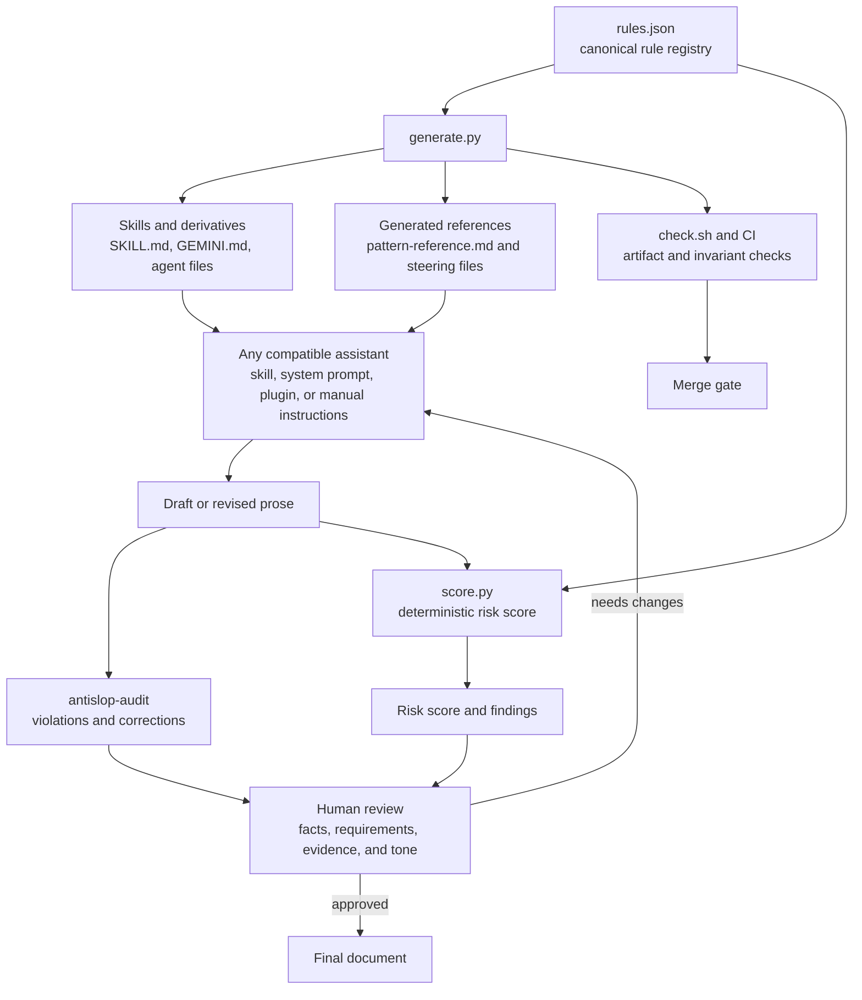

# Antislop

*By slop for slop, to remove slop in an AI slop world.*

Written as a late shower thought from my ranting [LinkedIn post](https://www.linkedin.com/posts/tawilr_you-didnt-verify-this-and-i-can-tell-share-7460237564889944064-lXxs/)

Two skills for writing like a human. Works with your favourite agent that supports SKILL.md or AGENTS.md.

- **antislop**: a writing style skill. Ambient, always-on. Suppresses AI writing patterns across everything you write.
- **antislop-audit**: a detection skill. Scores text 0-100 and returns a violations list. Zero exceptions for intent.

It catches:

- Banned vocabulary and phrases
- Antithesis as tone management ("not just X but Y" that decorates instead of argues)
- Structural tells (sentence, paragraph, and discourse-level patterns)
- Formatting habits (em-dashes, scare quotes, bolding, title case)
- Rhythmic giveaways (uniform length, parataxis, overlong sentences)
- Voice-level absences (no opinion, no experience, no position)

---

## Installation

### Install with openskills (recommended)

```bash
npx openskills install drunkrhin0/antislop --global
```

This installs to `~/.claude/skills/` so the skills are available across all projects. Leave off `--global` to install in the current directory instead.

### Ask your agent

Just ask your agent to install `drunkrhin0/antislop` from GitHub. Most will figure it out. The repo includes an `AGENTS.md` file for automatic skill discovery.

### Claude Code plugin

The repo ships a `.claude-plugin/plugin.json` manifest, so it loads as a Claude Code plugin straight from a local clone. No copying files into `~/.claude/skills/` first.

```bash
git clone https://github.com/drunkrhin0/antislop.git
claude --plugin-dir ./antislop
```

Claude Code finds `skills/antislop/SKILL.md` and `skills/antislop-audit/SKILL.md` under the default `skills/` scan, so the manifest does not need to list them one by one. Once loaded, the skills sit under the `antislop` namespace, for example `/antislop:antislop-audit`.

Run `claude plugin validate .claude-plugin/plugin.json` to check the manifest before you rely on it. The repo also ships a `.claude-plugin/marketplace.json`, so pointing `validate` at the bare repo root validates the marketplace file instead. Pass the manifest path explicitly to check the plugin.

The repo also self-hosts its own marketplace, so you can install without a local clone:

```bash
claude plugin marketplace add https://git.drunkrhin0.au/drunkrhin0/antislop.git
claude plugin install antislop@drunkrhin0
```

Not listed on Anthropic's community marketplace (that submission is a separate, manual step), but self-hosted install works today.

### Kiro

AWS Kiro reads antislop content two separate ways: a Power for the IDE and Web app, and the skills directly through Kiro's own skills support.

**Powers panel, local folder.** In Kiro, open the Powers panel (the lightning bolt icon), choose Add Custom Power, then Import power from a folder, and point it at the absolute path to `powers/antislop` in your clone. This is the path that can be checked directly against the files in this repo. It has not been run against a real Kiro install on this machine, so treat the result as unverified until someone tries it.

**GitHub URL, intended path, untested.** The plan is to install straight from a subdirectory URL:

```
https://github.com/drunkrhin0/antislop/tree/main/powers/antislop
```

Kiro's install docs say subdirectory URLs work. The official `kirodotdev/powers` repo puts each power at the top level of its own repository, for example `neon/POWER.md`. This repo nests the power one level deeper, at `powers/antislop/POWER.md`, so whether Kiro's importer follows that extra level is unconfirmed. The GitHub mirror is also behind and does not carry this work yet, so the URL above installs nothing today. Both the nesting question and the mirror push need to clear before this path is real.

**Workspace skills.** `.kiro/skills/antislop` and `.kiro/skills/antislop-audit` are relative symlinks into `skills/`. Cloning the repo and opening it as a Kiro workspace gives you both skills with no copying.

**Manual, `~/.kiro/skills/`.** Powers are IDE and Web only. `kiro-cli` has no `powers` subcommand, so this is the path for Kiro CLI users. See the row in the manual-install table below.

Not listed on Kiro's power registry (submission at https://kiro.dev/powers/submit/ is a separate, manual step, same as the Anthropic community marketplace above). Unlike the Claude Code plugin, no Kiro install path here has been confirmed working: the folder import has not been run, and the GitHub URL waits on the mirror push and on confirming that Kiro's importer follows the subdirectory nesting.

### Gemini web app (gemini.google.com)

Requires Gemini Advanced. Create a Gem:

1. Left sidebar → **Gem manager** → **New Gem**
2. Name it "Antislop"
3. Paste the contents of `skills/antislop/GEMINI.md` into the instructions field
4. Save and use that Gem for writing

Free tier: paste `skills/antislop/GEMINI.md` at the start of any chat instead.

### Agent (subagent)

A spawnable subagent with two modes: style (writing) and audit (scoring). Lives in `.opencode/agents/antislop.md` in the repo. The agent file format is opencode-specific, but the rules content works as a system prompt in any LLM.

Project-level use works automatically when the repo is cloned. opencode discovers `.opencode/agents/` in project directories. For global install, copy the agent file:

```bash
cp .opencode/agents/antislop.md ~/.config/opencode/agents/
```

Mention `@antislop` in opencode, or let the primary agent spawn it automatically when it detects a writing or auditing task. The agent is read-only: it returns corrected text or audit results, and the primary agent or user writes files.

The agent is a hand-maintained derivative of the canonical SKILL.md files, like GEMINI.md. When adding a rule, update the agent file alongside the other derivatives.

### Manual

Copy skill files straight into your agent's directory. No plugin system, no CLI install step.

| Agent | Target directory | What to copy |
|---|---|---|
| Claude Code | `~/.claude/skills/` | `skills/antislop/`, `skills/antislop-audit/` |
| opencode | `~/.config/opencode/skills/` | `skills/antislop/`, `skills/antislop-audit/` |
| Gemini CLI | `~/.gemini/extensions/antislop/` | `skills/antislop/gemini-extension.json`, `skills/antislop/GEMINI.md` |
| Kiro CLI | `~/.kiro/skills/` | `skills/antislop/`, `skills/antislop-audit/` |

```bash
# Claude Code / opencode
cp -r skills/antislop skills/antislop-audit ~/.claude/skills/

# Gemini CLI
mkdir -p ~/.gemini/extensions/antislop
cp skills/antislop/gemini-extension.json skills/antislop/GEMINI.md ~/.gemini/extensions/antislop/

# Kiro CLI
cp -r skills/antislop skills/antislop-audit ~/.kiro/skills/
```

Gemini CLI picks up the extension automatically on next launch.

---

## Usage

### Writing style (antislop)

Triggers automatically when you ask your agent to write or edit anything.

### Audit (antislop-audit)

Paste text and ask your agent to audit it with `/antislop-audit`

Returns a Formulaic Writing Risk Score (0-100), a violations table with severity and excerpt, word count, finding density, and a plain-English summary of what to fix first.

**Score bands:**
- 85-100: Clean. Reads like a person.
- 65-84: Some slop. Fixable with targeted edits.
- 40-64: Heavy slop. Significant rewrite needed.
- 0-39: Severe. This reads like unreviewed AI output.

**Writing profiles:**
- `general` (default): all rules active
- `technical`: technical documentation, API references (contextual terms like significant and robust are not penalized)

To add a new profile, see the `_profile_guide` in `rules.json`.

The score measures formulaic-writing risk and cannot prove AI authorship.

### Review a full tender or proposal

The workflow below works with any AI assistant that can follow a system prompt, load a skill, or accept pasted instructions. Antislop does not require a particular assistant.

Use Markdown when possible. It preserves headings, tables, lists, and section boundaries. Plain text also works. DOCX and PDF files can be opened directly by an assistant that supports those formats, but `score.py` accepts text through standard input, so extract those files first when using the local scorer.

```bash
# DOCX to Markdown, if pandoc is installed
pandoc tender.docx -t gfm -o tender.md

# PDF to text, preserving layout where possible
pdftotext -layout tender.pdf tender.txt

# Score the complete extracted document
python3 score.py --profile general < tender.txt
```

For a confidential tender, redact client identifiers before sending it to an external assistant. Keep an untouched local copy for comparison.

Run the review in three passes. Use a fresh conversation for each pass so the assistant does not treat its earlier rewrite as authoritative.

If the assistant has no skill or system-prompt support, provide the contents of `skills/antislop/SKILL.md` and `skills/antislop-audit/SKILL.md` as its instructions before starting the passes.

First, ask for an inventory and audit:

```text
Read the complete tender document at [absolute path]. Do not rewrite it yet.

Return:
1. The heading and section inventory.
2. A fact ledger containing every number, commitment, qualification, product claim, and customer requirement.
3. A Formulaic Writing Risk Score.
4. Violations grouped by section with short excerpts.
5. Unsupported claims and contradictions.

Do not invent facts. Return analysis only.
```

Second, ask for a controlled rewrite:

```text
Rewrite the tender section by section to remove detectable AI writing patterns.

Preserve every factual claim, number, requirement, qualification, product limitation, and customer-specific detail. Do not invent evidence, capabilities, certifications, outcomes, or commitments. Keep the original heading structure.

Return the revised document only.
```

Third, compare the original and revised documents:

```text
Compare the original tender with the revised tender.

Report every fact, number, claim, requirement, qualification, or commitment that changed. Also report added claims, removed claims, weakened caveats, and contradictions. Do not rewrite anything.
```

Accept the rewrite only after a human confirms that the fact ledger matches the source, every requirement remains answered, and no unsupported claim was introduced. The scorer measures formulaic-writing risk. It does not verify tender accuracy, compliance, or commercial approval.

### Antislop harness structure

The harness keeps rule maintenance, assistant integration, deterministic checks, and human approval as separate parts of the workflow.



The assistant can suggest or rewrite text. `rules.json`, `generate.py`, `score.py`, tests, CI, and branch protection provide deterministic controls. A human still owns factual accuracy, tender compliance, commercial commitments, approval, and merge.

---

## How to use effectively

**Let it run ambiently.** Both skills trigger automatically when you ask your agent to write, edit, or audit text. They activate on matching intent. No manual invocation needed.

**Audit before sending, not while writing.** Write freely. Let antislop clean up sentence-level patterns in real time. The mandatory pre-output scan catches em-dashes that slip through. Then run antislop-audit as a final gate before publishing. The audit catches what the style misses: paragraph redundancy, triplet overlap, semantic repetition.

**Bring content, not just form.** Antislop catches patterns: sentence structure, banned words, rhythm tells. It does not catch vague ideas or unsupported claims. You still need to bring specific experience, numbers, examples, and a point of view.

**Run the checklist.** The skill includes a 20+ item audit checklist. Run through it before finishing any piece. The items at the bottom matter most: redundancy, triplet overlap, antithesis, metaphors, endings. They catch what pattern matching can't.

**Don't over-apply.** Antislop is for prose meant to be read by humans. Skip it for code, config files, commit messages, structured data, or API docs. Those have their own conventions.

**For Gemini users.** The Gem or GEMINI.md copy approach works best. Style mode outputs to Canvas only. No preamble, no commentary. Audit mode returns the score and violations in chat.

---

## Version 2.0

Version 2.0 introduces the rule registry (`rules.json`) as the single source of truth for all writing rules. Each rule has a stable ID, severity, detection class, profile set, and overlap relationships. The generator (`generate.py`) renders pattern reference files from the registry, and the scorer (`score.py`) calculates scores using the registry metadata.

**What changed from 1.7:**
- Score renamed from "Slop Score" to "Formulaic Writing Risk Score"
- Authorship disclaimer added: score cannot prove AI authorship
- Writing profiles: general and technical (extensible via rules.json)
- Diminishing repetition: repeated instances of one rule diminish (100%, 50%, 25%), capped at 3x base weight
- 500-word normalization: comparable scores across different text lengths
- Overlap handling: one primary finding per text span, related findings unscored
- Rule registry: 146 rules with stable IDs, severity weights, and profile assignments

**Compatibility boundary:** 2.0.0 ships directly from 1.7.0. A 1.8 compatibility release was planned to correct contradictions and overlap handling while preserving the 1.7 score formula, but no 1.8.0 tag was ever cut (see `docs/adr/0002`); those corrections landed directly in 2.0 instead. The 1.7 score formula is not preserved in 2.0.

---

## Credits and inspiration

- [blader/humanizer](https://github.com/blader/humanizer) (MIT): 29-pattern taxonomy grounded in Wikipedia's Signs of AI Writing
- [jalaalrd/anti-ai-slop-writing](https://github.com/jalaalrd/anti-ai-slop-writing) (MIT): banned word and phrase lists, structural pattern rules
- [Reddit r/copywriting](https://www.reddit.com/r/copywriting/comments/1n3u03i/writing_instruction_to_prevent_ai_slop/): hard-banned phrases, emergency replacements, quality checks
- [ignorance.ai/field-guide-to-ai-slop](https://www.ignorance.ai/p/the-field-guide-to-ai-slop): structural patterns, parallelism analysis, metaphor detection, authenticity crisis framing
- [Banned: The Definitive Guide](https://docs.google.com/document/d/1uC9tBgfNZJytzLpg6MGk5mTfgJNbEK-h1hMLncQ5Mho/edit) (Creative Commons): comprehensive construction, phrase, and pattern taxonomy
- [Pangram](https://www.pangram.com/blog/comprehensive-guide-to-spotting-ai-writing-patterns): exhaustive AI vocabulary cross-reference, phrasing patterns, uniform sentence length, organizational tells
- [Anbeeld/WRITING.md](https://github.com/Anbeeld/WRITING.md) (MIT): specificity theater, catalog prose, regularity diagnostics, compound-modifier nuance, medium routing
- [Bugcrowd Design System — Tone & Language](https://bugcrowd.design/docs/guidelines/content-guidelines/language/): plain English substitutions, link text semantics, punctuation tell detection
- [hardikpandya/stop-slop](https://github.com/hardikpandya/stop-slop) (MIT): cherry-picked emphasis crutches, throat-clearing openers, meta-commentary, performative emphasis
- [apurvrdx1/tagore](https://github.com/apurvrdx1/tagore) (MIT): vocabulary additions (actually, enhance, showcase, interplay) and punchy one-liner closure pattern
- [petergyang/no-ai-slop](https://github.com/petergyang/no-ai-slop) (MIT): padding adverbs, colon reveals, expert cosplay, voice preservation framing, protect-the-fact editing principle
- Self: scare quotes, random bolding, ambiguous bold bullets, em-dash as false authority, voice and authenticity framing

---

## License

MIT
